# Sounds in Space (SiS)

By Google's Creative Lab, Sydney

This is not an officially supported Google product

Contents:

- [What is the Sounds in Space Experiment?](#intro)
- [How does it work?](#how)
- [Known Issues](#issues)
- [Developer Setup](#setup)
- [How to create your own experience](#how-to)
- [General Notes](#general-notes)
- [Contributors](#contributors)

## What is the Sounds in Space Experiment?

Sounds in Space is an augmented reality audio experiment by Google's Creative Lab in Sydney. It allows you to make your own locational audio experience in a physical space.

This is very much an experiment. We are still learning lots and would love you to help us share in this experimentation and learning!

## How does it work?

Sounds in Space is a mobile app that was built with Unity and [Google's ARCore tech](https://developers.google.com/ar/). 

ARCore uses the phone's camera to track its movement through space. As the phone approaches a predetermined location an audio track is triggered and plays through the person’s headphones or speakers.

You can upload your own sound files to a phone (or group of phones), and use the app's UI to place the sounds around a physical space. The experience can be saved and later experienced by an audience.

To the audience, this is an audio only experience. The phone screen is only required for initial set-up. In fact, we found the experienced worked best when the phone and its screen were mostly invisible. We wanted our audience to focus on the audio rather than the phone or what's on it screen. So we experimented with attaching it to the body with various props similar to a lanyard. The phone does not need to be visible as long as the camera is unobstructed and facing outward.

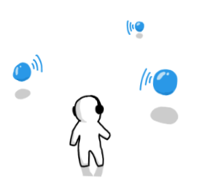
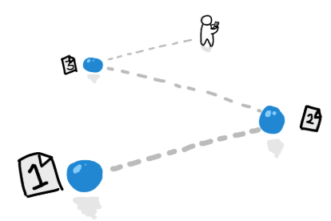

------------

## Known Issues

- This project has mainly been tested on Pixel XL mobile devices running **Android 9 Pie**. There is no support for running on any other (non-Android) operating system at this time.
- Connecting & disconnecting bluetooth audio devices can cause audio issues. If this occurs, you may need to restart the app.
- At this stage, the app only recognises .WAV audio filetypes.
- When loading your own audio files onto the device, be wary that the app will load all audio into memory on startup. (This can be optimised in the future)
- When switching between apps or opening the app again, AR core may experience some tracking issues. If this happens to you, try restarting the app!

------------

## Developer Setup

The app has not been released to the public on a mobile app store, but can be downloaded and built in Unity. So far the experience has only been tested on fairly recent Android phones, such as a Pixel or Samsung Galaxy 7 or higher.

1. Download Unity version [2018.4.13f1](https://unity3d.com/unity/qa/lts-releases?version=2018.4) for compatibility.

2. Clone this repo to your machine

3. Import the project into Unity.

4. Deploy to an [ARCore compatible device](https://developers.google.com/ar/discover/supported-devices).

5. Have a fun.

------------

## How to create your own experience

Summary:

1. Create sound files.
2. Copy the sound files onto the phone’s local storage.
3. Use the app to position the sound files around a room.
4. Optionally copy the sound files to the other phones.

------------

### Step 1: Create sound files

Important: You will need to use your own sound equipment. This experiment does not record sound.

Create your sounds and save them in .wav format. They can be whatever you like -- narrative, soundscapes, dialogue, etc.

Technically the app supports up to 255 sounds (depending on the size and quality of each sound file). However, in our experience the kit works best with 20-40.

------------

### Step 2. Copy sound files to the phone

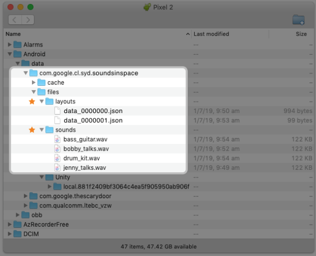

#### If your sound files are on a Mac computer

1. Plug the phone into your Mac (use an adapter if necessary).
2. Download and install Android File Transfer.
3. Android File Transfer should open automatically, but if it doesn’t, open it manually by going to Finder -> Applications.
    - If Android File Transfer does not detect your device, go to the end of this document for assistance.
    - In Android File Transfer go to Android/data/com.google.cl.syd.soundsinspace/files.
    - There are 2 important folders inside ‘files’, ‘layouts’ & ‘sounds’.
4. Copy all of your wav sound files into the folder called ‘sounds’ as shown below (Android/data/com.google.cl.syd.soundsinspace/files/sounds).

#### If your sound files are on a Windows computer

1. Plug the phone into your Windows machine using the supplied USB cable (use an adapter if necessary).
2. A file transfer window will pop up as soon as you connect the phone.
3. In the file window go to Android/data/com.google.cl.syd.soundsinspace/files.
    - There are 2 important folders inside ‘files’, ‘layouts’ & ‘sounds’.
4. Copy all of your wav sound files into the folder called ‘sounds’ as shown below (Android/data/com.google.cl.syd.soundsinspace/files/sounds).

------------

### Step 3. Place your sound files

#### A - Open the ‘Sounds In Space’ app, and set your ‘Start Position’

1. The ‘Start Position’, is an important reference point when beginning the experience. The sounds will be positioned relative to this starting position, so people must start the experience at exactly that location and orientation.
2. Stand on your starting reference position, point the phone forward, and press the ‘Set Start Position’ button.
3. A virtual ‘feet icon’ will appear, positioned roughly where you were standing.
4. It may help to indicate the starting point to your audience using sinage, or by placing a mat on the floor.

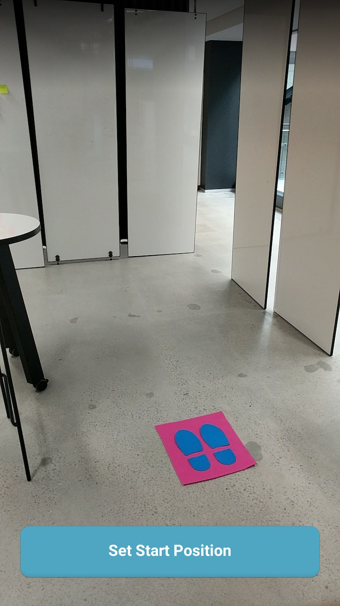
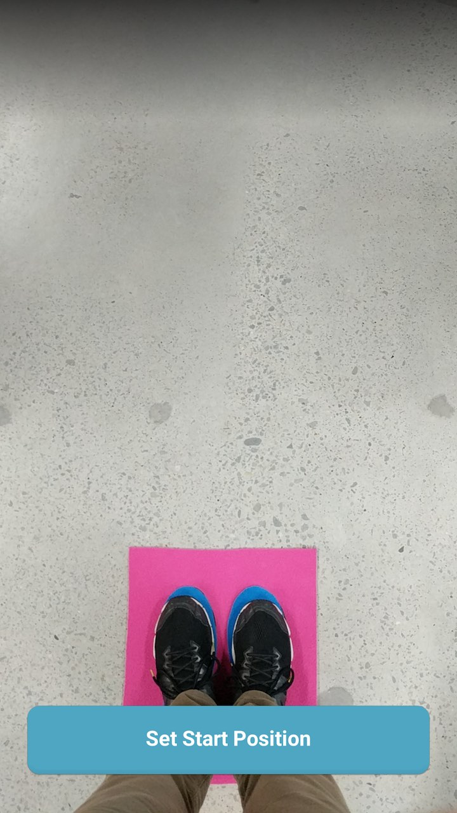
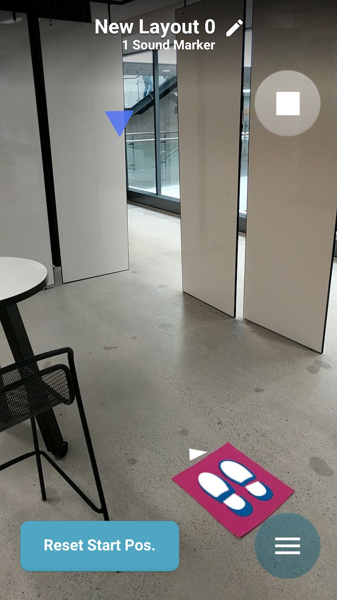

#### B - Place Sound Markers in the room/space

1. Open the menu at the bottom right of the screen.
2. Tap on ‘Sound Markers’
3. This is where your Sound Markers will be listed.
4. Tap on the green ‘Place Markers’ button to create markers.
5. A 3D cursor will appear, you can the ‘+’ icon, or anywhere on the screen to create a new Sound Marker at the cursor position.
6. You can also place the Marker at the position of the phone you are holding.

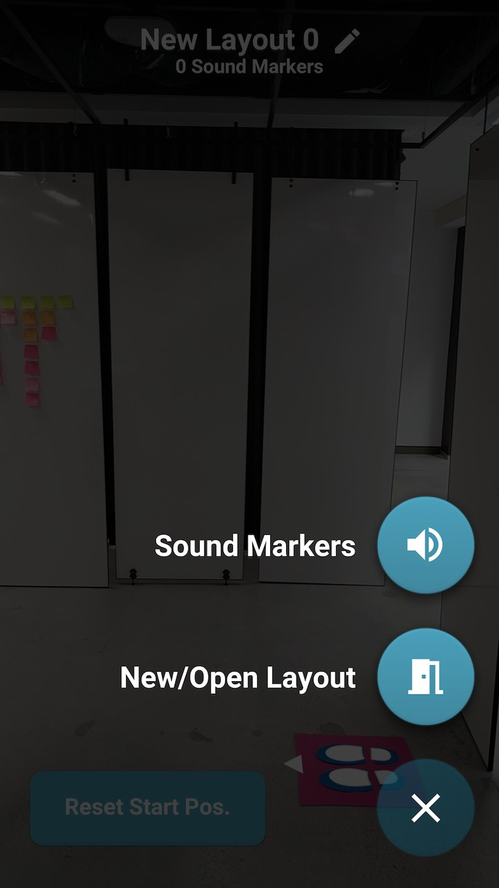
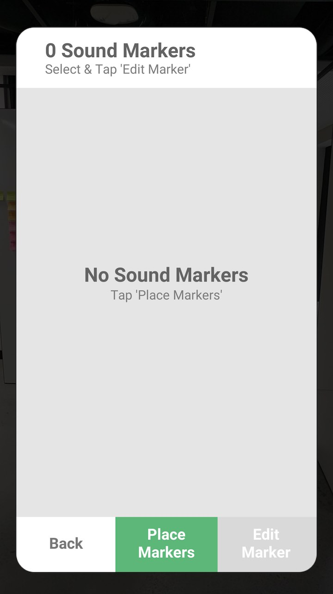
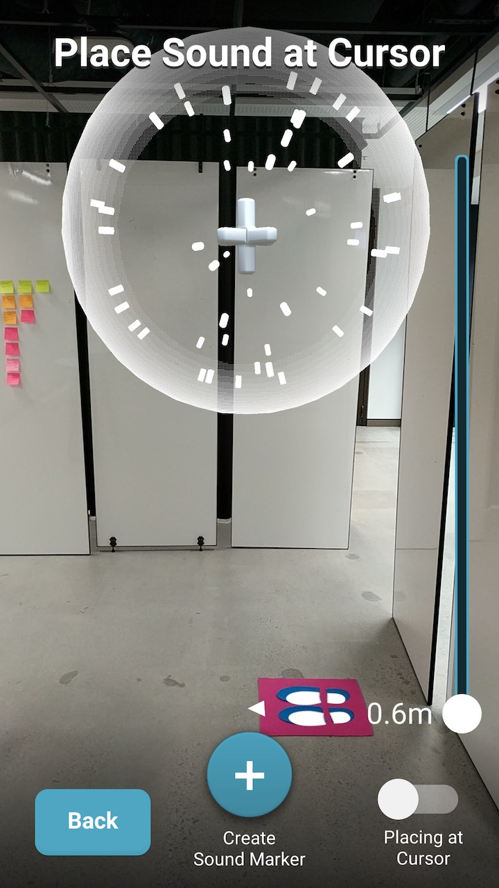

#### C - Edit the Sound Markers you have placed (WAV file, Sound Radius, Name, etc...)

Now that you have created some Sound Markers, you can tap on any of them to edit their properties.

- Once a Sound Marker is selected, you can change:
  - The audio file being played
  - The distance away from the sound, for a user to hear it.
  - The position of the marker
  - The name of the marker
  - The colour or shape
- You can also tap ‘More...’ for advanced options. Like deleting the marker.
- You can also edit and delete all the markers in your scene.
  - By tapping ‘Sound Markers’ from the main menu.
  - Select the marker you want to edit, then tap ‘Edit Marker’

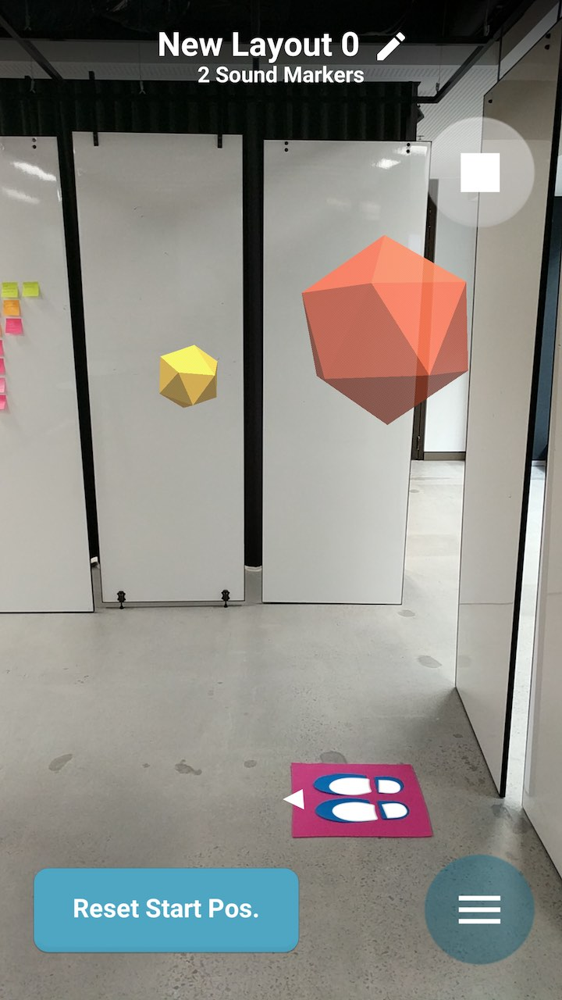
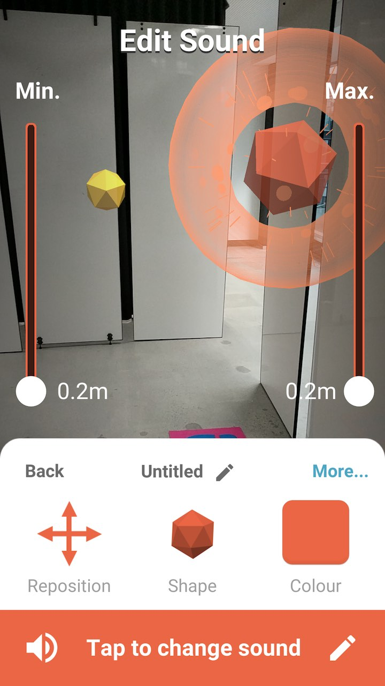
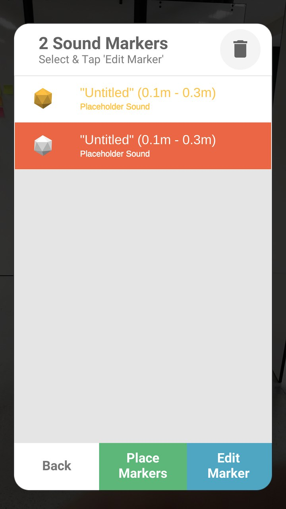

- Change Sound File
- Edit Sound Distance
  - Set the min/max radius.
  - Set max all the way to the top and it will ALWAYS be heard
- Delete Sound Marker
  - In ‘More…’ menu

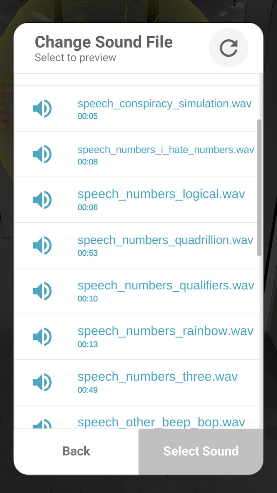
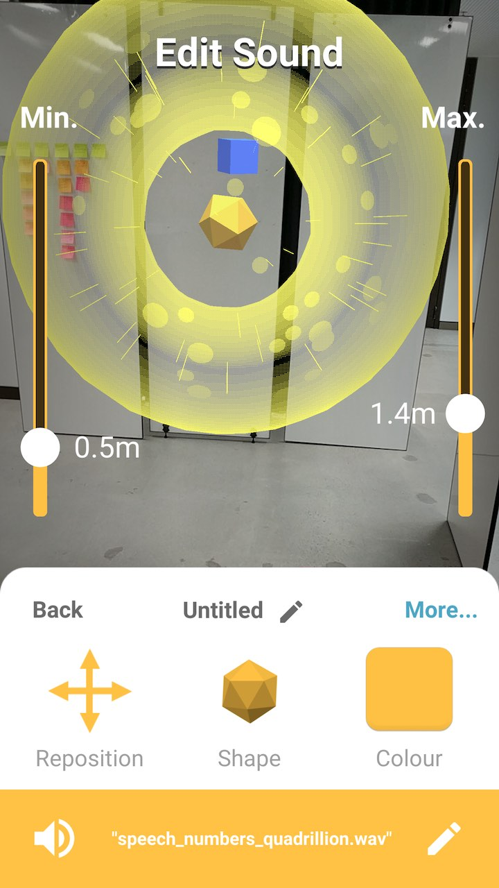
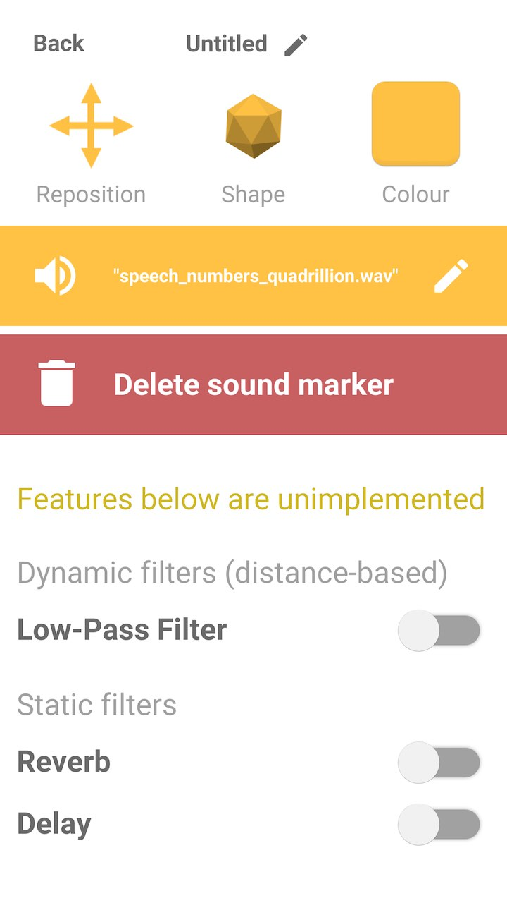

#### D - Load, duplicate and create new Layouts (a layout is a collection of Sound Markers designed for a room/space)

- You can access the ‘Layouts’ list from the Main Menu.
- Tap a layout from the list to highlight it…
  - Tap ‘Open Layout’ to load those Sound Markers into the app.
  - Tap the duplicate button at the top right of the window to copy and modify a layout that already exists.
- Tap ‘New Layout’ to create an empty room/space

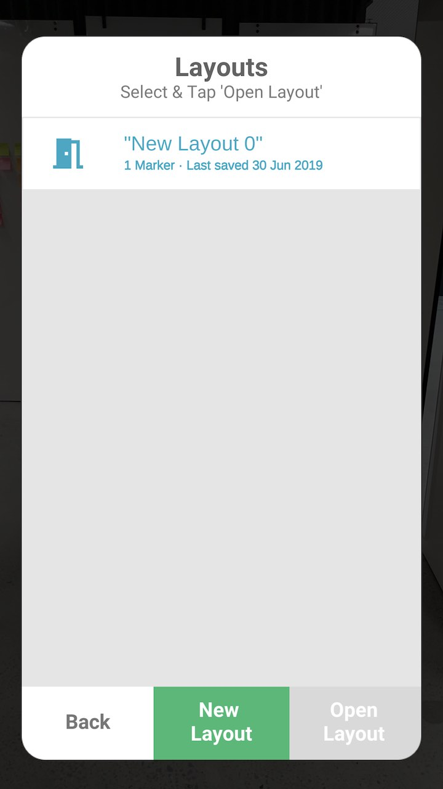

Note: You can move or reset your starting reference position at any time.

- You can move to a different position at any time and press the ‘Reset Start Pos.’ button.
- If you do this, any sounds you have positioned will move to a different position. So they are in the same relative position to your starting location (the feet icon).

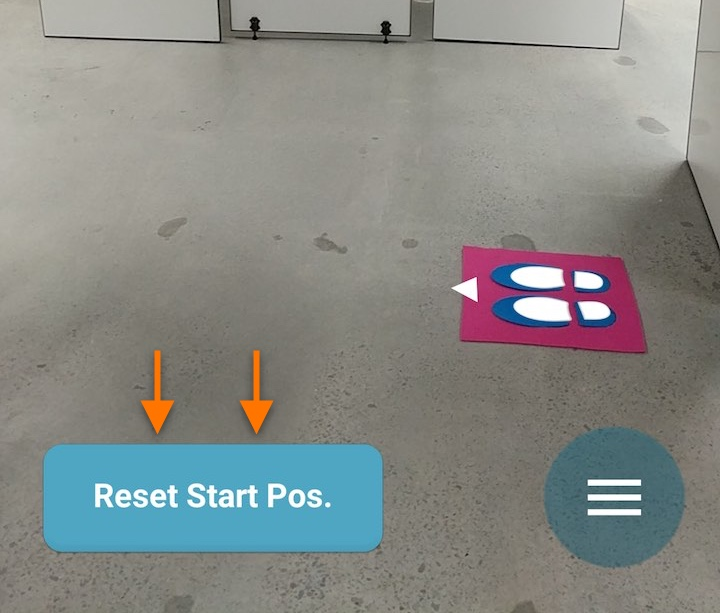

### Step 4. Copy the experience to the other phones

To avoid repeating the above steps and placing sounds around the room with every phone, you can copy the sound files and their location in the room to the other phones by:

1. Using Android File Transfer (on Mac) or the file transfer window (on Windows), and copying the two important folders inside the ‘files’ folder from your phone.
    - The important folders are named ‘sounds’ and ‘layouts’.
2. Next, copy those folders to each phone you want the experience to run on by repeating Step 2 - ‘Copy sound files to the first phone’.

## Using a FLIC button

In the FLIC app, when a button is clicked, double clicked, or held, send an 'Intent' action.
In the Intent edit menu, set the 'Action (Optional)' field to "com.google.cl.syd.soundsinspace.flic.click" and press SAVE ACTION.

If you want to use other FLIC events (like 'double click' and 'click and hold'), set an extra key-value pair in the Intent editor.
- Click: (default)
- Double click event: ["type" : "double-clicked"]
- Click and Hold event: ["type" : "click-hold"]

## General Notes

### How to “play” your Sounds In Space experience

Once all your sound files have been placed around the room and loaded onto all phones you can playback your Sounds In Space experience with just a little more prep on each phone:

*We advise completing these steps before your audience arrives.

1. Go to the starting point (for example a mat on the floor), facing the right direction.
2. Hold the phone at around the same height it would sit in the prop.
3. Open the “solokit” app.
4. Tap the button ‘Set Start Position’ button, on startup (or ‘Reset Start Pos.’).
5. The last layout that was open will be loaded in by default. You can change layouts by going to the ‘Layouts’ list and loading the appropriate layout.
6. Repeat for each phone in the kit.

### Notes

- You might want to run a test on each phone before giving it to other people to try. You can check the position of your sounds visually by looking through the phone screen.
- It’s a good idea to run this test (on each device) once a day, or any time the phones have been off or not in use for several hours.

### Tips for a great experience

- The experiment uses the phone’s camera to understand its position in a physical space. Make sure the phone’s back camera is not covered and that the room is not too dark. Some experimentation may be needed.
- Ensure the room/space contains a few distinguishing physical features. For example, furniture, wallpaper, plants. A room that is completely or almost completely empty with monochrome coloured walls may not work well.
- If sounds are not positioning correctly try moving the phone around so the camera can see and learn about your surroundings.
- For longer experiences ensure the phones and headphones are charging when not in use.
- For longer experiences, it’s a good idea to occasionally check that the sounds are still positioned correctly. The sounds may lose their positions if the phone is turned off or the camera is covered for an extended period of time.
- The experience has not been tested with more than a few dozen sounds. It’s likely it will work fine with more, but this has not been confirmed.
- The experience has been tested in smaller rooms, around two to three times the size of a typical bedroom. It’s likely it will work well in much larger rooms, but confirmation and testing is needed.

## Android File Transfer isn’t working

[Click here for troubleshooting help](https://www.androidphonesoft.com/resources/fix-android-file-transfer-not-working-mac.html)

## Contributors

 - [Rupert Parry](http://rparry.me) | [Github](https://github.com/rupertparry) | [Twitter](https://twitter.com/rupert_parry)
 - Byron Hallett
 - [Nick Cellini](http://ncellini.com) | [Github](https://github.com/cellininicholas) | [Twitter](https://twitter.com/nfcellini)
 - [Jude Osborn](https://github.com/JudeOsborn)

## License
[Apache 2.0 license.](https://www.apache.org/licenses/LICENSE-2.0)

------------
